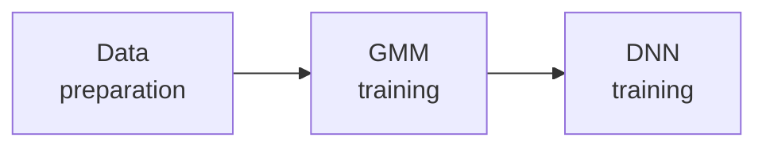
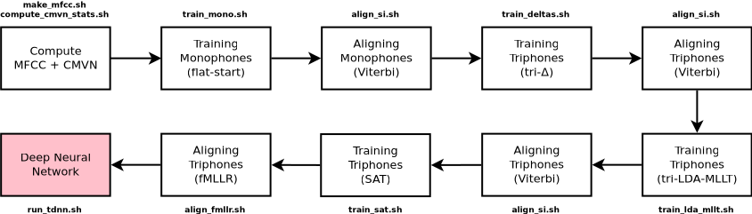

# Kaldi - tutorial for training acoustic models

[Paper](https://www.isca-speech.org/archive/IberSPEECH_2018/abstracts/IberS18_P1-13_Batista.html): 
**Baseline Acoustic Models for Brazilian Portuguese Using Kaldi Tools**     
A comparison between Kaldi and CMU Sphinx for Brazilian Portuguese was
performed. Resources for both toolkits were developed and made publicly 
available to the community. 

**NOTE**: this paper uses the outdated nnet2 recipes, while this repo has been
updated to the chain models' recipe via nnet3 scripts. If you really want nnet2
scripts, you may find them on git tag.

# TL;DR
```bash
$ ./prep_env.sh /path/to/kaldi/egs/myproject
$ cd /path/to/kaldi/egs/myproject/s5/
$ ./run.sh
```
    
# Tutorial
The tutorial is composed mainly by three big steps:



All three are accomplished through stages across the scrcipt `run.sh`. Data
preparation occurs on stage one, GMM training on stages two until eight, and
finally DNN training on stage nine.

## Data preparation
According to Kaldi's [tutorial for dummies](http://kaldi-asr.org/doc/kaldi_for_dummies.html),
the directory tree for new projects must follow the structure below:

```text
           path/to/kaldi/egs/YOUR_PROJECT_NAME/s5
                                 ├─ path.sh
                                 ├─ cmd.sh
                                 ├─ run.sh
                                 │ 
  .--------------.-------.-------:------.-------.
  |              |       |       |      |       |
 mfcc/         data/   utils/  steps/  exp/   conf/
                 |                              ├─ decode.config
  .--------------:--------------.               └─ mfcc.conf
  │              │              │
train/          test/         local/
  ├─ spkTR_1/    ├─ spkTE_1/    └─ dict/
  ├─ spkTR_2/    ├─ spkTE_2/        ├─ lexicon.txt
  ├─ spkTR_3/    ├─ spkTE_3/        ├─ non_silence_phones.txt
  ├─ spkTR_n/    ├─ spkTE_n/        ├─ optional_silence.txt
  │              │                  ├─ silence_phones.txt
  ├─ spk2gender  ├─ spk2gender      └─ extra_questions.txt
  ├─ wav.scp     ├─ wav.scp   
  ├─ text        ├─ text      
  ├─ utt2spk     ├─ utt2spk   
  └─ corpus.txt  └─ corpus.txt
``` 

The script `prep_env.sh` gives the kick-off by initializing the directory and
file structure tree, mostly by making symbolic links to the `mini_librispeech` 
stuff. But the resources are create by the first stage of `run.sh`.

### Audio corpus
The default data downloaded by the scripts and used during training is the
LapsBenchmark dataset (check the
[`lapsbm16k`](https://gitlab.com/fb-audio-corpora/lapsbm16k) repo).

When you switch to your own dataset please keep in mind the pattern followed in
LapsBM to name files and directories, where 'M' and 'F' in the dirname
correspond to the gender of the speaker.

```bash
$ for dir in $(ls | sort -R | head -n 8) ; do tree $dir -C | head -n 6 ; done
 
LapsBM-M031              LapsBM-M018               LapsBM-M010              LapsBM-M024
├── LapsBM_0601.txt      ├── LapsBM_0341.txt       ├── LapsBM_0181.txt      ├── LapsBM_0461.txt
├── LapsBM_0601.wav      ├── LapsBM_0341.wav       ├── LapsBM_0181.wav      ├── LapsBM_0461.wav
├── LapsBM_0602.txt      ├── LapsBM_0342.txt       ├── LapsBM_0182.txt      ├── LapsBM_0462.txt
├── LapsBM_0602.wav      ├── LapsBM_0342.wav       ├── LapsBM_0182.wav      ├── LapsBM_0462.wav
├── LapsBM_0603.txt      ├── LapsBM_0343.txt       ├── LapsBM_0183.txt      ├── LapsBM_0463.txt

LapsBM-M033              LapsBM-F014               LapsBM-M030              LapsBM-M027
├── LapsBM_0641.txt      ├── LapsBM_0261.txt       ├── LapsBM_0581.txt      ├── LapsBM_0521.txt
├── LapsBM_0641.wav      ├── LapsBM_0261.wav       ├── LapsBM_0581.wav      ├── LapsBM_0521.wav
├── LapsBM_0642.txt      ├── LapsBM_0262.txt       ├── LapsBM_0582.txt      ├── LapsBM_0522.txt
├── LapsBM_0642.wav      ├── LapsBM_0262.wav       ├── LapsBM_0582.wav      ├── LapsBM_0522.wav
├── LapsBM_0643.txt      ├── LapsBM_0263.txt       ├── LapsBM_0583.txt      ├── LapsBM_0523.txt
```

### Dictionary
You will need our [`nlp-generator`](https://gitlab.com/fb-nlp/nlp-generator)
software in order to generate the dictionary. Java is required to be installed. 
Although this does cause some burden during the script exectution, it is easy
when switching datasets, especially if such dataset doesn't come with a 
phoetic dictionary.

### Language model
An already-trained 3-gram language model is available at our 
[`kaldi-resources`](https://gitlab.com/fb-asr/fb-asr-resources/kaldi-resources)
repo. It is also automatically downloaded.

## GMM model training
The schematic below shows the pipeline to training a HMM-DNN acoustic model
using Kaldi (for more details read our 
[paper](https://www.isca-speech.org/archive/IberSPEECH_2018/abstracts/IberS18_P1-13_Batista.html)).
These steps are accomplished by running stages 2 to 8 in `run.sh`.



## DNN model training
Stage 9 in `run.sh` calls a script called `run_tdnn.sh`, which actually follows
this entire pipeline below.


## Online decoding
See [online](./online) dir.


# References
- [Kaldi Tutorial](https://www.eleanorchodroff.com/tutorial/kaldi/) by Eleanor Chodroff
- [Understanding Kaldi mini librispeech recipe - part I - GMM](https://medium.com/@qianhwan/understanding-kaldi-recipes-with-mini-librispeech-example-part-1-hmm-models-472a7f4a0488) by Qianhui Wan
- [Understanding Kaldi mini librispeech recipe - part II - DNN](https://medium.com/@qianhwan/understanding-kaldi-recipes-with-mini-librispeech-example-part-1-hmm-models-472a7f4a0488) by Qiangui Wan

# Citation

If you use these codes or want to mention the paper referred above, please cite 
us as one of the following: 

> Batista, C., Dias, A.L., Sampaio Neto, N. (2018) Baseline Acoustic Models for
> Brazilian Portuguese Using Kaldi Tools. Proc. IberSPEECH 2018, 77-81, DOI:
> 10.21437/IberSPEECH.2018-17.

```bibtex
@inproceedings{Batista2018,
  author    = {Cassio Batista and Ana Larissa Dias and Nelson {Sampaio Neto}},
  title     = {{Baseline Acoustic Models for Brazilian Portuguese Using Kaldi Tools}},
  year      = {2018},
  booktitle = {Proc. IberSPEECH 2018},
  pages     = {77--81},
  doi       = {10.21437/IberSPEECH.2018-17},
  url       = {http://dx.doi.org/10.21437/IberSPEECH.2018-17}
}
```    

[](https://ufpafalabrasil.gitlab.io/ "Visite o site do Grupo FalaBrasil") [](https://portal.ufpa.br/ "Visite o site da UFPA")

__Grupo FalaBrasil (2020)__ - https://ufpafalabrasil.gitlab.io/      
__Universidade Federal do Pará (UFPA)__ - https://portal.ufpa.br/     
Cassio Batista - https://cassota.gitlab.io/    
Larissa Dias - larissa.engcomp@gmail.com
