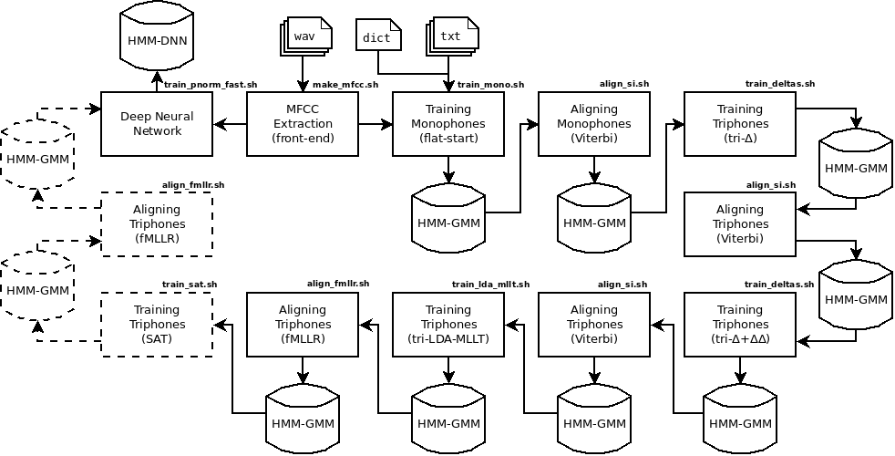

# Kaldi - tutorial para treino de modelo acústico   
    
# Requirements:
* __Git__: is needed to download Kaldi and this recipe.
* __Kaldi__: is the toolkit for speech recognition that we use.
* __g2p__: is a Grapheme-To-Phoneme Converter. This software is available at https://gitlab.com/fb-nlp/nlp.git.     


# Preparing directories:   

According to Kaldi's [tutorial for dummies](http://kaldi-asr.org/doc/kaldi_for_dummies.html),
the directory tree for new projects must follow the structure below:

```
           path/to/kaldi/egs/YOUR_PROJECT_NAME/
                                 ├─ path.sh
                                 ├─ cmd.sh
                                 ├─ run.sh
                                 │ 
  .--------------.-------.-------:------.------.-------------.
  |              |       |       |      |      |             |
 MFCC/         data/   utils/  steps/  exp/  local/        conf/
  └─ make_mfcc   |                             └─ score.sh   ├─ decode.config
  .--------------:--------------.                            └─ mfcc.conf
  │              │              │
train/          test/         local/
  ├─ spkTR_1/    ├─ spkTE_1/    └─ dict/
  ├─ spkTR_2/    ├─ spkTE_2/        ├─ lexicon.txt
  ├─ spkTR_3/    ├─ spkTE_3/        ├─ non_silence_phones.txt
  ├─ spkTR_n/    ├─ spkTE_n/        ├─ optional_silence.txt
  │              │                  ├─ silence_phones.txt
  ├─ spk2gender  ├─ spk2gender      └─ extra_questions.txt
  ├─ wav.scp     ├─ wav.scp            
  ├─ text        ├─ text               
  ├─ utt2spk     ├─ utt2spk            
  └─ corpus.txt  └─ corpus.txt         
```     

* __fb\_00\_create\_envtree.sh__ :
This script creates the directory structure shown above, except the `spkXX_n`
inside the `data/train` and `data/test` folders. Notice that the data-dependent
files (inside the `data` dir), although created, they __DO NOT__ have any
content yet. IOW, they're only initialized as empty files. A stupid choice of
the developer.    
```
./fb_00_create_envtree.sh path/to/kaldi/egs/YOUR_PROJECT_NAME
```   


* __fb\_01\_split\_train\_test.sh__:
This script fulfills the `data/train` and `data/test` directories. The data is
divided as training set and test set (90% for training and 10% for testing), and
the files within the dirs are data-dependent. The folders `train/spkTR_n` and
`test/spkTE_n` contain symbolic links to the actual wav-transcription base dir.   
```
./fb_01_split_train_test.sh path/to/audio/dataset/dir path/to/kaldi/egs/YOUR_PROJECT_NAME
```   


* __fb\_02\_define\_localdict.sh__:
This script specially fulfills the files inside `local/dict` dir. A dependency
is the `g2p` software, which files must be in the same directory of the `fb_02_define_localdict.sh` script.   
```
./fb_02_define_localdict.sh path/to/kaldi/egs/YOUR_PROJECT_NAME
```   
   
# Training Acoustic Models:  
  
* __util/run.sh__:
This is a shell script for training the acoustic models, but it's recommended
that you run the commands one by one by copying and pasting into the shell. The
Figure below shows the pipeline to training a hybrid HMM-DNN acoustic model
using Kaldi (for more details read this 
[paper](https://www.isca-speech.org/archive/IberSPEECH_2018/abstracts/IberS18_P1-13_Batista.html)).


    

# Demo Corpora
If you are using the Demo corpora or another similar small corpora, you will
need to change the value of the `num_utts_subset` parameter in the file
`path/to/kaldi/egs/YOUR_PROJECT_NAME/steps/nnet2/get_egs.sh`, from 300 to 20 in
order to the [DNN script work properly][2].    

* __util/RESULTS__:
This file contains the results of the acoustic models obtained using the Demo
Audio Corpora. The Demo corpora is available at
[https://gitlab.com/fb-asr/fb-am-tutorial/demo-corpora.git][1].   

# Language Model
A language model is available at
[https://gitlab.com/fb-asr/fb-asr-resources/kaldi-resources.git][3]. If you want
to use it, place the `lm.arpa` in the
`path/to/kaldi/egs/YOUR_PROJECT_NAME/data/local/tmp` directory.   


A nice tutorial by [Eleanor Chodroff](https://www.eleanorchodroff.com/tutorial/kaldi/kaldi-training.html) 
might also be worthy taking a look at.


[1]:https://gitlab.com/fb-asr/fb-am-tutorial/demo-corpora.git
[2]:https://groups.google.com/forum/#!msg/kaldi-help/e2EHVCQGE_Y/0uwBkGm9BQAJ
[3]:https://gitlab.com/fb-asr/fb-asr-resources/kaldi-resources.git

## Citation

If you use this code or want to mention the paper referred above, please cite us
as one of the following: 

> Batista, C., Dias, A.L., Sampaio Neto, N. (2018) Baseline Acoustic Models for Brazilian Portuguese Using Kaldi Tools. Proc. IberSPEECH 2018, 77-81, DOI: 10.21437/IberSPEECH.2018-17.

```
@inproceedings{Batista2018,
  author={Cassio Batista and Ana Larissa Dias and Nelson {Sampaio Neto}},
  title={{Baseline Acoustic Models for Brazilian Portuguese Using Kaldi Tools}},
  year=2018,
  booktitle={Proc. IberSPEECH 2018},
  pages={77--81},
  doi={10.21437/IberSPEECH.2018-17},
  url={http://dx.doi.org/10.21437/IberSPEECH.2018-17}
}
```    

__Grupo FalaBrasil (2018)__    
__Universidade Federal do Pará__     
Cassio Batista - cassio.batista.13@gmail.com      
Larissa Dias - larissa.engcomp@gmail.com
