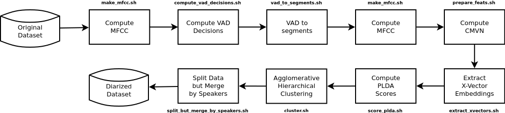

# Speaker diarization

Recipe for spekaer diarization using Kaldi.

## Clustering (standalone)

Check [`clustering/`](./clustering) dir.
Based on [`pyannote-audio`](https://github.com/pyannote/pyannote-audio) lib.

## Notes

- Dataset used in the recipe consists of 5 audios from the English portion of
  the CallHome dataset.
- CallHome is 2-channel, μ-law 8 kHz telephone speech and it is converted on
  the fly via sox under the `wav.scp` file to mono-channel, 16 kHz PCM 
  (see `fblocal/prep_data.sh`). If you're dealing with data already in PCM
  format then you'll need to edit the script.
- No model is trained. Instead, the scripts download a pre-trained 
  [SRE16 model](https://david-ryan-snyder.github.io/2017/10/04/model_sre16_v2.html).

# References

- [Speaker Diarization with Kaldi](https://towardsdatascience.com/speaker-diarization-with-kaldi-e30301b05cc8) by Yoav Ramon (Towards Data Science blog)
- ["Speakers in the Wild" informal documentation](https://github.com/kaldi-asr/kaldi/issues/2523#issuecomment-408935477) by David Ryan Snyder
- [NIST SRE 2016 Xvector Recipe](https://david-ryan-snyder.github.io/2017/10/04/model_sre16_v2.html) by David Ryan Snyder
- Kaldi's `callhome_diarization` v2 recipe on `egs/`.

 

__Grupo FalaBrasil (2020)__ - https://ufpafalabrasil.gitlab.io/      
__Universidade Federal do Pará (UFPA)__ - https://portal.ufpa.br/     
Cassio Batista - https://cassota.gitlab.io/    
