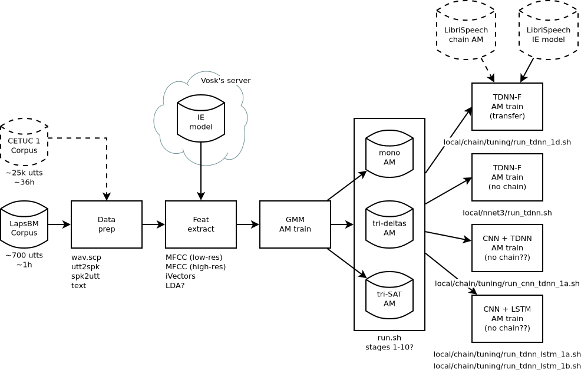

# Librispeech Recipe Adapted to FalaBrasil Data

These scripts are experimentally being used for forced alignment. For ASR you
may stick with `mini-librispeech` recipe.

The idea was also not train the ivector extractor from scratch but to use 
Vosk's pre-trained model instead. However, mismatches in the dimension of the
features made that infeasible: MFCCs were extracted as low-res feats 
(20 mel bins, 20 ceps feats), and the ivector dimension was also reduced to 
30-dim in v0.3 :( 
Check out the original pipeline below just for reference.

 

__Grupo FalaBrasil (2021)__ - https://ufpafalabrasil.gitlab.io/      
__Universidade Federal do Pará (UFPA)__ - https://portal.ufpa.br/     
Cassio Batista - https://cassota.gitlab.io/    
