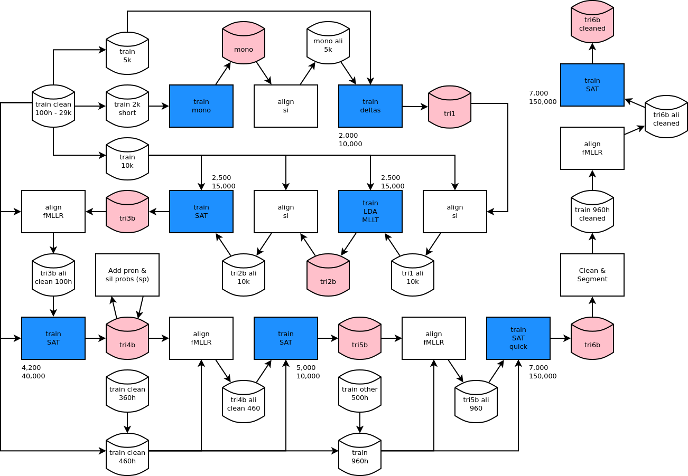
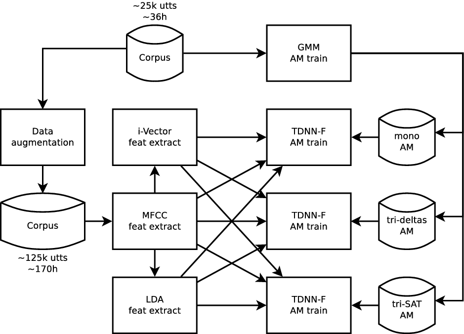

# Librispeech Recipe Adapted to FalaBrasil Data

These scripts are experimentally being used for forced alignment. For ASR you
may stick with `mini-librispeech` recipe.

Beware nnet's context (and therefore, network depth) has been reduced to 
something around ~15 on either side. Number of neurons on each hidden layer
has also been reduced to a half of the original. Since I am training to less 
than 1/10 of the original data, it makes sense to use less parameters for a 
faster training. No brainer, win-win.

Main scripts are `run_debug.sh` and `run_valendo.sh` which train models over
LapsBM and CETUC-DVD1de4 datasets, respectively. The latter is a quarter size
of the original CETUC dataset, ~36h. After training, `run_align.sh` performs
forced alignment across all models under `exp/`.

The idea was also not to train the i-Vector extractor from scratch but to use 
Vosk's pre-trained model instead. However, mismatches in the dimension of the
features made that infeasible: MFCCs were extracted as low-res feats 
(20 mel bins, 20 ceps feats), and the i-Vector dimension was also reduced to 
30-dim in v0.3 :( This is so to make the model smaller and faster for mobile
platforms.

Anyway, check out the original pipeline below just for reference.

The top-right-most block shows a transfer-learning-based procedure where a
pre-trained model over a larger dataset in English is expected to be fine-tuned
with data in Brazilian Portuguese. However, first I have to prove that chain
models work for phonetic alignment. So far it's been a bad experience, which
led me to parse some scripts to train nnet3 models without the chain structure.

The whole pipeline executes a combination of parameters/resources that are
switched in pairs during simulation, as show in the following Table. Each
column shows two values of each parameter that has been permutated throughout 
the experiments. Each row combining multiple parameters correspond to a 
**single instance of the simulation, as there are many two-by-two combinations**.

| GMM topo   | feature | chain | ivector | frame subsampling |
|:----------:|:-------:|:-----:|:-------:|:-----------------:|
| mono       | MFCC    | yes   | 100-dim | 3                 |
| tri-deltas | LDA     | no    | no      | 1                 |

Every combination is made to work over a TDNN-F network topology. 
Later on I might perform some experiments using CNNs and LSTMs in 
combination with time-delay ones.

## Notes (to self) for AWS

- Setup a `p3.2xlarge` or `g4dn.2xlarge`. The former is expensive but its GPU is faster.
- Make sure Anaconda comes with the AMI: `numpy`, `matplotlib` and `termcolor` are needed
- Install `rsync` for later `exp` and `alignme` dir retrieval with compression capabilities
- Exec `ds2fb` inside male-female `scripts` dir to generate phoneset-compatible PTS baseline
- Check Kaldi's docker installation by running `yesno` recipe
- Check NVIDIA card & CUDA lib health status with `nvidia-smi` tool

 

__Grupo FalaBrasil (2021)__ - https://ufpafalabrasil.gitlab.io/      
__Universidade Federal do Pará (UFPA)__ - https://portal.ufpa.br/     
Cassio Batista - https://cassota.gitlab.io/    
