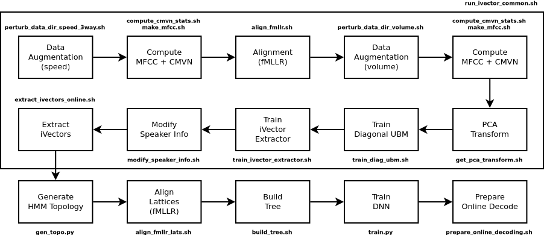

# Tutorial for training models with Kaldi

[Paper](https://www.isca-speech.org/archive/IberSPEECH_2018/abstracts/IberS18_P1-13_Batista.html): 
**Baseline Acoustic Models for Brazilian Portuguese Using Kaldi Tools**     
A comparison between Kaldi and CMU Sphinx for Brazilian Portuguese was
performed. Resources for both toolkits were developed and made publicly 
available to the community. 

**NOTE**: this paper uses the outdated nnet2 recipes, while this repo has been
updated to the chain models' recipe via nnet3 scripts. If you really want nnet2
scripts, you may find them on git tag.


The tutorial is composed mainly by three big steps:

```mermaid
graph LR;
    A[Data<br>preparation] --> B[GMM<br>training];
    B                      --> C[DNN<br>training];
```

All three are accomplished through stages across the script `run.sh`. Data
preparation occurs on stage one, GMM training on stages two until eight, and
finally DNN training on stage nine.

## Data preparation
According to Kaldi's [tutorial for dummies](http://kaldi-asr.org/doc/kaldi_for_dummies.html),
the directory tree for new projects must follow the structure below:

```text
           path/to/kaldi/egs/YOUR_PROJECT_NAME/s5
                                 ├─ path.sh
                                 ├─ cmd.sh
                                 ├─ run.sh
                                 │ 
  .--------------.-------.-------:------.-------.
  |              |       |       |      |       |
 mfcc/         data/   utils/  steps/  exp/   conf/
                 |                              ├─ decode.config
  .--------------:--------------.               └─ mfcc.conf
  │              │              │
train/          test/         local/
  ├─ spkTR_1/    ├─ spkTE_1/    └─ dict/
  ├─ spkTR_2/    ├─ spkTE_2/        ├─ lexicon.txt
  ├─ spkTR_3/    ├─ spkTE_3/        ├─ non_silence_phones.txt
  ├─ spkTR_n/    ├─ spkTE_n/        ├─ optional_silence.txt
  │              │                  ├─ silence_phones.txt
  ├─ spk2gender  ├─ spk2gender      └─ extra_questions.txt
  ├─ wav.scp     ├─ wav.scp   
  ├─ text        ├─ text      
  ├─ utt2spk     ├─ utt2spk   
  └─ corpus.txt  └─ corpus.txt
``` 

The script `prep_env.sh` gives the kick-off by initializing the directory and
file structure tree, mostly by making symbolic links to the `mini_librispeech` 
stuff. But the resources are create by the first stage of `run.sh`.

### Audio corpus
The default data downloaded by the scripts and used during training is the
LapsBenchmark dataset (check the
[`lapsbm16k`](https://gitlab.com/fb-audio-corpora/lapsbm16k) repo).

When you switch to your own dataset please keep in mind the pattern followed in
LapsBM to name files and directories, where 'M' and 'F' in the dirname
correspond to the gender of the speaker.

```bash
$ for dir in $(ls | sort -R | head -n 8) ; do tree $dir -C | head -n 6 ; done
 
LapsBM-M031              LapsBM-F019               LapsBM-M010              LapsBM-F006
├── LapsBM_0601.txt      ├── LapsBM_0361.txt       ├── LapsBM_0181.txt      ├── LapsBM_0101.txt
├── LapsBM_0601.wav      ├── LapsBM_0361.wav       ├── LapsBM_0181.wav      ├── LapsBM_0101.wav
├── LapsBM_0602.txt      ├── LapsBM_0362.txt       ├── LapsBM_0182.txt      ├── LapsBM_0102.txt
├── LapsBM_0602.wav      ├── LapsBM_0362.wav       ├── LapsBM_0182.wav      ├── LapsBM_0102.wav
├── LapsBM_0603.txt      ├── LapsBM_0363.txt       ├── LapsBM_0183.txt      ├── LapsBM_0103.txt

LapsBM-M033              LapsBM-F014               LapsBM-F013              LapsBM-M027
├── LapsBM_0641.txt      ├── LapsBM_0261.txt       ├── LapsBM_0241.txt      ├── LapsBM_0521.txt
├── LapsBM_0641.wav      ├── LapsBM_0261.wav       ├── LapsBM_0241.wav      ├── LapsBM_0521.wav
├── LapsBM_0642.txt      ├── LapsBM_0262.txt       ├── LapsBM_0242.txt      ├── LapsBM_0522.txt
├── LapsBM_0642.wav      ├── LapsBM_0262.wav       ├── LapsBM_0242.wav      ├── LapsBM_0522.wav
├── LapsBM_0643.txt      ├── LapsBM_0263.txt       ├── LapsBM_0243.txt      ├── LapsBM_0523.txt
```

**NOTE**: this corpus contains less than an hour of recorded speech and is 
being used for just for demonstration of the script's correctness (and because 
it is faster to train). Therefore, it **will NOT** give you good results, as 
you probably need hundreds of hours of recorded data for a proper recognizer to 
reliably work.

### Dictionary (lexicon)
The recipe downloads a phonetic dictionary from 
[`nlp-resources`](https://gitlab.com/fb-nlp/nlp-resources), which was
generated over the 200k most frequent words of Brazilian Portuguese language.
You better check if your transription files contain some words that are not in
the dictionary yet. If so, then you will need our 
[`nlp-generator`](https://gitlab.com/fb-nlp/nlp-generator) software in order to
generate the G2P conversion for such missing words. Java is required to be 
installed for the generator.

### Language model
An already-trained 3-gram language model is available at our 
[`nlp-resources`](https://gitlab.com/fb-nlp/nlp-resources)
repo. It is also automatically downloaded.

## GMM model training
The schematic below shows the pipeline to training a HMM-DNN acoustic model
using Kaldi (for more details read our 
[paper](https://www.isca-speech.org/archive/IberSPEECH_2018/abstracts/IberS18_P1-13_Batista.html)).
These steps are accomplished by running stages 2 to 8 in `run.sh`.


## DNN model training
Stage 9 in `run.sh` calls a script called `run_tdnn.sh`, which actually follows
this entire pipeline below.



# References
- [Kaldi Tutorial](https://www.eleanorchodroff.com/tutorial/kaldi/) by Eleanor Chodroff
- [Understanding Kaldi mini librispeech recipe - part I - GMM](https://medium.com/@qianhwan/understanding-kaldi-recipes-with-mini-librispeech-example-part-1-hmm-models-472a7f4a0488) by Qianhui Wan
- [Understanding Kaldi mini librispeech recipe - part II - DNN](https://medium.com/@qianhwan/understanding-kaldi-recipes-with-mini-librispeech-example-part-1-hmm-models-472a7f4a0488) by Qiangui Wan

Beware that `train.py` is very hungry: it took more than 3 days (~76h) to train
the DNN over 20 epochs in a single NVIDIA GPU using an audio corpora of
approximately 180h data. Other scripts such as `train_ivector_extractor.sh`,
OTOH, are CPU-intensive and take some hours to run on a 64-core cluster (~5h).


[](https://ufpafalabrasil.gitlab.io/ "Visite o site do Grupo FalaBrasil") [](https://portal.ufpa.br/ "Visite o site da UFPA")

__Grupo FalaBrasil (2020)__ - https://ufpafalabrasil.gitlab.io/      
__Universidade Federal do Pará (UFPA)__ - https://portal.ufpa.br/     
Cassio Batista - https://cassota.gitlab.io/    
Larissa Dias - larissa.engcomp@gmail.com    
